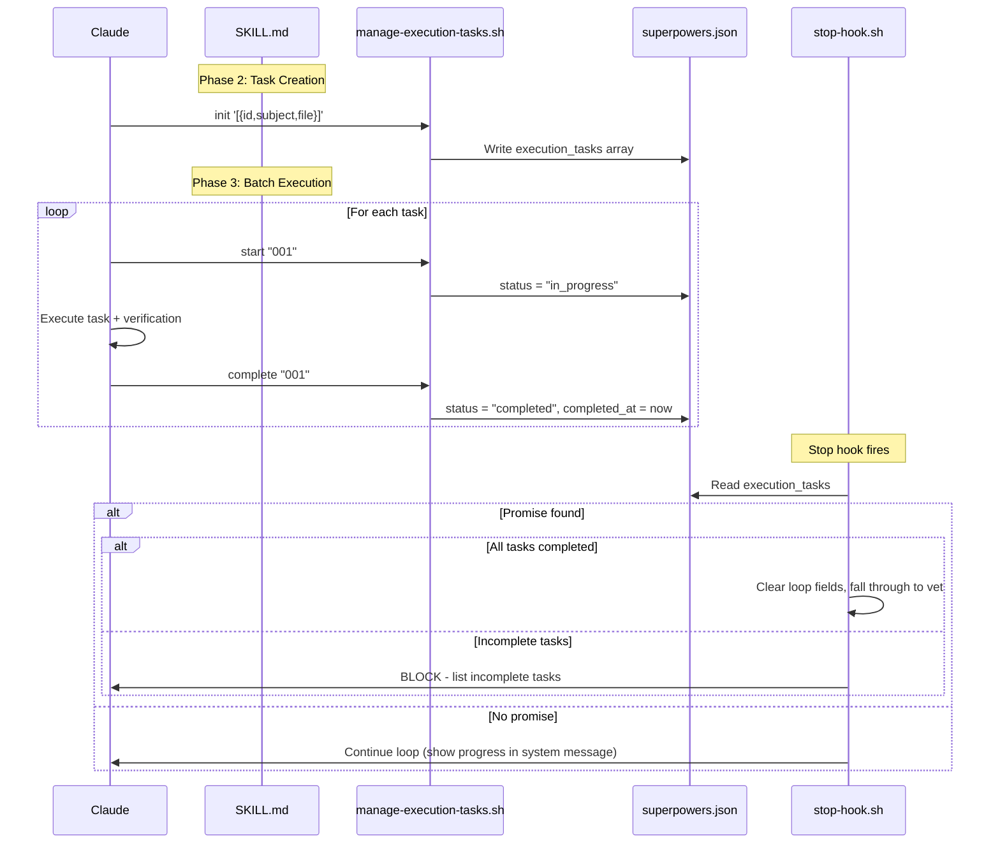

# Architecture

## Component Interaction



## Files Modified

| File | Change |
|------|--------|
| `scripts/manage-execution-tasks.sh` | New script |
| `hooks/stop-hook.sh` | Add execution_tasks progress + completion gate |
| `skills/executing-plans/SKILL.md` | Add script calls in Phase 2 and Phase 3 |
| `lib/utils.sh` | No changes needed (existing functions sufficient) |

## State File Schema

```
superpowers.json
├── session_id          (shared)
├── created_at          (shared)
├── updated_at          (shared)
├── active              (loop)
├── iteration           (loop)
├── max_iterations      (loop)
├── completion_promise  (loop)
├── prompt              (loop)
├── started_at          (loop)
├── skill_name          (loop)
├── task                (vet)
├── pending_prompt      (vet)
├── modified_files      (vet)
├── skip_turn           (vet)
└── execution_tasks     (NEW - execution tracking)
    └── [{id, subject, file, status, completed_at}]
```

## Script Interface

```bash
# Initialize with task list (Phase 2)
manage-execution-tasks.sh init '<json-array>'

# Mark task in progress (Phase 3, step 2a)
manage-execution-tasks.sh start <task-id>

# Mark task completed (Phase 3, step 2e)
manage-execution-tasks.sh complete <task-id>

# Show progress summary
manage-execution-tasks.sh status
```

## stop-hook Integration Points

Two integration points in stop-hook.sh Phase 1 (loop check):

1. **System message enhancement** (line ~151): When building system message for loop continuation, read `execution_tasks` and append progress count.

2. **Promise verification gate** (line ~116-122): When `COMPLETION_PROMISE == "EXECUTION_COMPLETE"` and promise IS found, additionally check `execution_tasks`. If any task is not `completed`, treat as promise NOT found (continue loop with error message).
