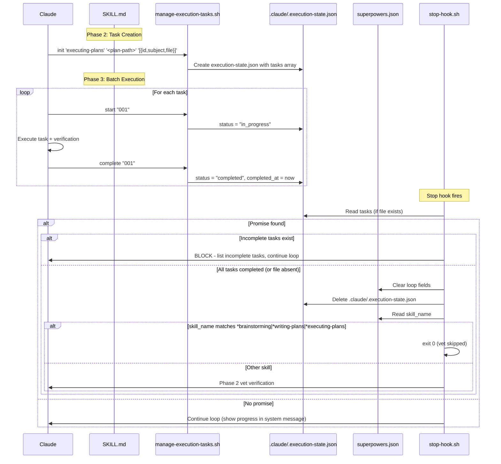

# Architecture

## Component Interaction



## Files Modified

| File | Change |
|------|--------|
| `scripts/manage-execution-tasks.sh` | New script |
| `hooks/stop-hook.sh` | Add task gate (reads `.execution-state.json`) + file cleanup + skill_name no-vet bypass |
| `skills/executing-plans/SKILL.md` | Add script calls in Phase 2 and Phase 3 |
| `.claude/.execution-state.json` | New runtime artifact (created/deleted per execution) |
| `.gitignore` | Add `.claude/.execution-state.json` |
| `lib/utils.sh` | No changes needed (existing functions sufficient) |

## State File Schemas

### superpowers.json (unchanged — no execution_tasks field)

```
superpowers.json
├── session_id          (shared)
├── created_at          (shared)
├── updated_at          (shared)
├── active              (loop)
├── iteration           (loop)
├── max_iterations      (loop)
├── completion_promise  (loop)
├── prompt              (loop)
├── started_at          (loop)
├── skill_name          (loop + no-vet — set by task-start.sh from <command-name> tag)
├── task                (vet)
├── pending_prompt      (vet)
├── modified_files      (vet)
└── skip_turn           (vet)
```

### .claude/.execution-state.json (new — generic, per-execution)

```
.execution-state.json
├── session_id          — session that created this file
├── skill               — skill using this tracking (e.g., "executing-plans")
├── plan_path           — path to the plan folder
└── tasks[]
    ├── id              — task identifier
    ├── subject         — human-readable task description
    ├── file            — relative path to task markdown file
    ├── status          — "pending" | "in_progress" | "completed"
    └── completed_at    — UTC timestamp or null
```

File lifecycle:
- **Created**: by `manage-execution-tasks.sh init` at Phase 2 start
- **Updated**: by `manage-execution-tasks.sh start/complete` during Phase 3
- **Deleted**: by `stop-hook.sh` after all tasks verified complete
- **Absent**: no task tracking active — stop-hook skips task gate

## Script Interface

```bash
# Initialize execution state (Phase 2)
manage-execution-tasks.sh init '<skill>' '<plan-path>' '<json-array>'

# Mark task in progress (Phase 3, before task execution)
manage-execution-tasks.sh start <task-id>

# Mark task completed (Phase 3, after verification passes)
manage-execution-tasks.sh complete <task-id>

# Show progress summary
manage-execution-tasks.sh status
```

## stop-hook Integration Points

Four integration points in stop-hook.sh Phase 1 (loop check):

1. **System message enhancement** (loop iteration, promise not found): Read `.claude/.execution-state.json` if present and append progress count to the continuation message.
   ```
   Superpower loop iteration 5 | Progress: 3/8 tasks completed | To stop: output <promise>...
   ```

2. **Task gate** (promise found, `.execution-state.json` exists): Read `tasks` array. If any task is not `completed`, block exit and continue loop with error listing incomplete items.

3. **File cleanup** (promise found, task gate passed): Delete `.claude/.execution-state.json` to prevent stale state blocking future runs.

4. **No-vet bypass** (after cleanup, loop fields cleared): Read `skill_name` and match against the bypass list using glob trailing-match:
   ```bash
   case "$SKILL_NAME" in
     *brainstorming|*writing-plans|*executing-plans)
       exit 0  # Built-in phase verification — skip vet
       ;;
   esac
   # Other skills fall through to vet
   ```

### skill_name Matching

`skill_name` is written to `superpowers.json` by `task-start.sh` when a slash command is invoked. The value is the full command path extracted from the `<command-name>` tag:

| Skill invocation | `skill_name` in superpowers.json |
|-----------------|----------------------------------|
| `/superpowers:brainstorming` | `/superpowers:brainstorming` |
| `/superpowers:writing-plans` | `/superpowers:writing-plans` |
| `/superpowers:executing-plans` | `/superpowers:executing-plans` |

The `case` statement MUST use glob trailing-match patterns. Exact-match patterns (e.g., `brainstorming`) will NOT match the full path and the no-vet bypass will silently fail.
