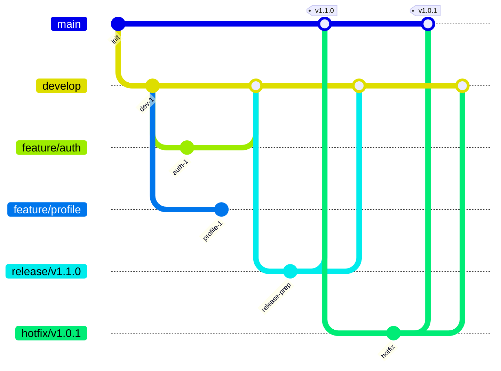

# Classic GitFlow

Traditional GitFlow workflow with separate integration and production branches.

## Base Branches

- **main/master**: Holds production-ready code. Only updated via releases and hotfixes.
- **develop**: Primary integration branch for all ongoing development.

## Topic Branches

- **feature/**: Used for all new functionality. Branches from `develop`, merges back to `develop`.
- **bugfix/**: Reserved for bugfixes. Branches from `develop`, merges back to `develop`.
- **release/**: Used to prepare a new production release. Branches from `develop`, merges to both `main` and `develop`.
- **hotfix/**: Reserved for urgent, production-breaking fixes. Branches from `main`, merges to both `main` and `develop`.
- **support/**: (Optional) Used to manage and maintain older, currently supported versions of the software.

## Branch Flow

