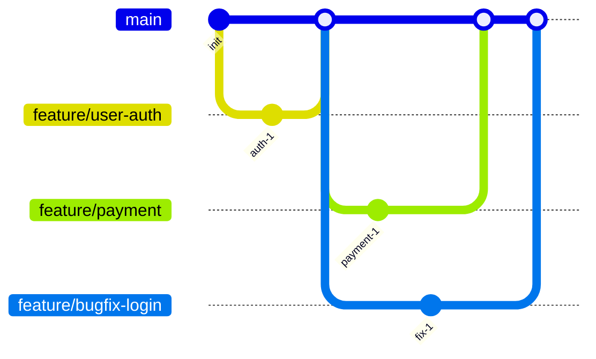

# GitHub Flow

Simplified workflow with a single base branch and feature branches.

## Base Branches

- **main**: The single source of truth and the only base branch.

## Topic Branches

- **feature/**: Covers all development work: new features, refactors, and bug fixes. Branches from `main`, merges back to `main`.

## Branch Flow

## Characteristics

- Simpler than Classic GitFlow
- No separate develop branch
- All work happens in feature branches
- Direct merge to main after review
- Suitable for continuous deployment
