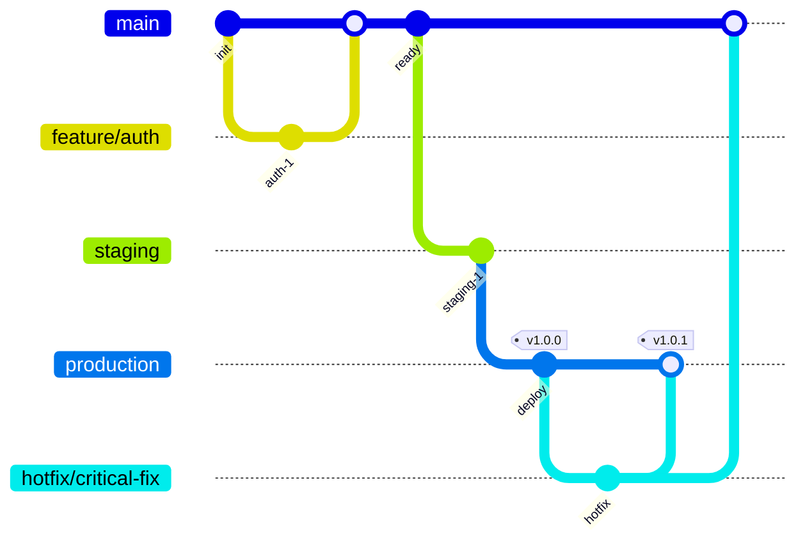

# GitLab Flow

Multi-environment workflow with separate production and staging branches.

## Base Branches

- **production**: The only branch that deploys to the production environment.
- **main**: The primary integration branch where all new features are initially merged.
- **staging**: The final gate. Always updated from `main` before being promoted to `production`.

## Topic Branches

- **feature/**: Used for all new functionality. Branches from `main`, merges back to `main`.
- **hotfix/**: Reserved for urgent, production-breaking fixes. Branches from `production`, merges to both `production` and `main`.

## Branch Flow

## Characteristics

- Environment-based branching
- Staging branch for pre-production testing
- Production branch for live deployment
- Hotfixes branch from production
- Features merge through main → staging → production
