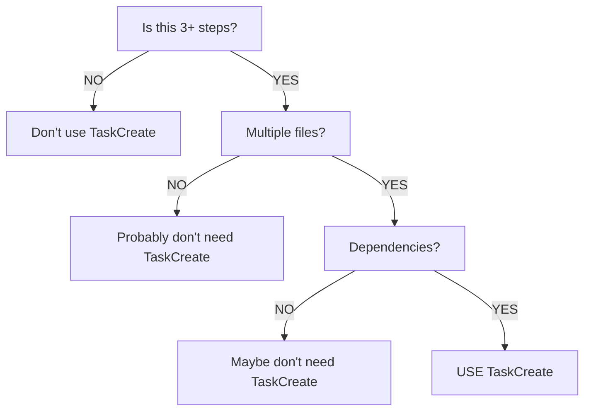

# Task Management Tool Usage Standards

Best practices for using TaskCreate and TaskUpdate tools in plugin components.

## When to Use

**Use TaskCreate for:**
- Tasks with 3+ distinct steps
- Multi-file/multi-component work
- Sequential dependencies
- User progress visibility needs

**Don't use for:**
- Single file edits
- 1-2 step operations
- Pure research/reading
- Conversational responses

## Core Requirements

### 1. Dual Form Naming

Every task needs both forms:

```markdown
TaskCreate:
- subject: "Run tests"           // Imperative: what to do
- activeForm: "Running tests"    // Continuous: doing it now
- description: "Execute test suite and verify all tests pass"
```

### 2. Real-time Updates

- Use TaskUpdate to mark `in_progress` BEFORE starting work
- Use TaskUpdate to mark `completed` IMMEDIATELY after finishing
- Never batch updates

### 3. Single Active Task

Exactly ONE task as `in_progress` at any time.

### 4. Honest Status

Only mark `completed` when FULLY done. If blocked/failed, keep as `in_progress` and create new task for resolution.

## Task Structure

### TaskCreate Parameters

```markdown
- subject: "Imperative verb-first form"
- description: "Detailed description of what needs to be done"
- activeForm: "Present continuous -ing form"
```

Tasks are created with `pending` status by default.

### TaskUpdate Parameters

```markdown
- taskId: "task-id-from-create"
- status: "pending|in_progress|completed"
```

## Good Examples

### Multi-Step Plugin Creation

```markdown
# Step 1: Create tasks
TaskCreate:
- subject: "Create plugin manifest and directory structure"
- description: "Set up .claude-plugin/plugin.json and create component directories"
- activeForm: "Creating plugin manifest and directory structure"

TaskCreate:
- subject: "Implement command with frontmatter"
- description: "Write command file with YAML frontmatter and instructions"
- activeForm: "Implementing command with frontmatter"

TaskCreate:
- subject: "Validate plugin structure"
- description: "Run validation scripts to ensure plugin meets standards"
- activeForm: "Validating plugin structure"

# Step 2: Start first task
TaskUpdate:
- taskId: "task-1"
- status: "in_progress"

# Step 3: Complete first task and start second
TaskUpdate:
- taskId: "task-1"
- status: "completed"

TaskUpdate:
- taskId: "task-2"
- status: "in_progress"
```

### Single File Edit

Don't use TaskCreate - just do it:
- "Fix typo in README.md"
- "Add missing description field"
- "Update version number"

## Common Mistakes

**Wrong:** Missing activeForm
```markdown
TaskCreate:
- subject: "Run tests"
- description: "Execute test suite"
```

**Right:** Both forms present
```markdown
TaskCreate:
- subject: "Run tests"
- description: "Execute test suite and verify all tests pass"
- activeForm: "Running tests"
```

**Wrong:** Multiple in_progress
```markdown
TaskUpdate: {taskId: "1", status: "in_progress"}
TaskUpdate: {taskId: "2", status: "in_progress"}
```

**Right:** Only one in_progress
```markdown
TaskUpdate: {taskId: "1", status: "completed"}
TaskUpdate: {taskId: "2", status: "in_progress"}
```

**Wrong:** Batched updates (do Task 1, Task 2, Task 3, then update all)

**Right:** Sequential updates (do Task 1, mark complete, do Task 2, mark complete...)

## In Plugin Components

### Commands

```markdown
**Use TaskCreate tool** to track the following phases:
1. Scan plugin structure
2. Validate components
3. Generate report

Use TaskUpdate tool to mark each phase as in_progress before starting and completed after finishing.
```

### Agents

```markdown
**Use TaskCreate tool** at the start to create tasks for multi-step workflows.
Use TaskUpdate tool to mark each task as in_progress before starting, completed immediately after finishing.
```

## Quick Decision Tree

