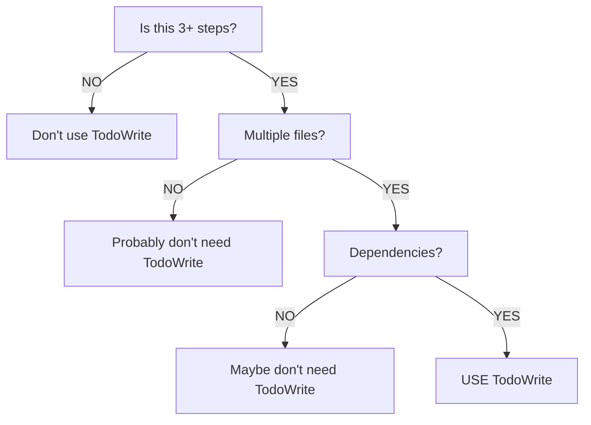

# TodoWrite Tool Usage Standards

Best practices for using the TodoWrite tool in plugin components.

## When to Use

**Use TodoWrite for:**
- Tasks with 3+ distinct steps
- Multi-file/multi-component work
- Sequential dependencies
- User progress visibility needs

**Don't use for:**
- Single file edits
- 1-2 step operations
- Pure research/reading
- Conversational responses

## Core Requirements

### 1. Dual Form Naming

Every task needs both forms:

```json
{
  "content": "Run tests",           // Imperative: what to do
  "activeForm": "Running tests",    // Continuous: doing it now
  "status": "in_progress"
}
```

### 2. Real-time Updates

- Mark `in_progress` BEFORE starting work
- Mark `completed` IMMEDIATELY after finishing
- Never batch updates

### 3. Single Active Task

Exactly ONE task as `in_progress` at any time.

### 4. Honest Status

Only mark `completed` when FULLY done. If blocked/failed, keep as `in_progress` and create new task for resolution.

## Task Structure

```json
{
  "content": "Imperative verb-first form",
  "activeForm": "Present continuous -ing form",
  "status": "pending|in_progress|completed"
}
```

## Good Examples

### Multi-Step Plugin Creation

```json
[
  {
    "content": "Create plugin manifest and directory structure",
    "activeForm": "Creating plugin manifest and directory structure",
    "status": "in_progress"
  },
  {
    "content": "Implement command with frontmatter",
    "activeForm": "Implementing command with frontmatter",
    "status": "pending"
  },
  {
    "content": "Validate plugin structure",
    "activeForm": "Validating plugin structure",
    "status": "pending"
  }
]
```

### Single File Edit

Don't use TodoWrite - just do it:
- "Fix typo in README.md"
- "Add missing description field"
- "Update version number"

## Common Mistakes

**Wrong:** Missing activeForm
```json
{"content": "Run tests", "status": "in_progress"}
```

**Right:** Both forms present
```json
{
  "content": "Run tests",
  "activeForm": "Running tests",
  "status": "in_progress"
}
```

**Wrong:** Multiple in_progress
```json
[
  {"content": "Task 1", "status": "in_progress"},
  {"content": "Task 2", "status": "in_progress"}
]
```

**Right:** Only one in_progress
```json
[
  {"content": "Task 1", "status": "completed"},
  {"content": "Task 2", "status": "in_progress"}
]
```

**Wrong:** Batched updates (do Task 1, Task 2, Task 3, then update all)

**Right:** Sequential updates (do Task 1, mark complete, do Task 2, mark complete...)

## In Plugin Components

### Commands

```markdown
**Use TodoWrite tool** to track the following phases:
1. Scan plugin structure
2. Validate components
3. Generate report
```

### Agents

```markdown
**Use TodoWrite tool** at the start to create tasks for multi-step workflows.
Mark each task as in_progress before starting, completed immediately after finishing.
```

## Quick Decision Tree


